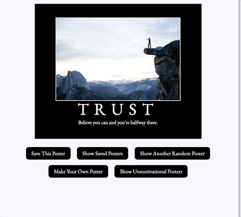

# Hang in There  

### Abstract:
[//]: <> (Briefly describe what you built and its features. What problem is the app solving? How does this application solve that problem?)
  This app allows users to view, create, and remove motivational and unmotivational posters.  

### Installation Instructions:
[//]: <> (What steps does a person have to take to get your app cloned down and running?)
  A user would need to clone down the repo by going to [git hub] <https://github.com/James-Cochran/Super-Fun-Posters> and clicking the code button and copying the ssh.  They can then run git clone in there terminal and paste the ssh.  Once the repo has been cloned they can open it in their code editor.  After it is loaded run the open index.html command to run the application locally on a browser window.

### Preview of App:
[//]: <> (Provide ONE gif or screenshot of your application - choose the "coolest" piece of functionality to show off. gifs preferred!)
    Maybe not the coolest piece of functionality, but definitely the most fun. 

### Context:
[//]: <> (Give some context for the project here. How long did you have to work on it? How far into the Turing program are you?)
    This project had a 9 day timeframe.  I set aside a few hours every day for project work.  I really didn't want to just focus on this.  I tried to break it up with class review and study time.  I found it very helpful this way.  Going through the iterations, I found that they coincided very well with each days lessons.  Kind of giving a practical use as a study aid almost.

### Contributors:
[//]: <> (Who worked on this application? Link to your GitHub. Consider also providing LinkedIn link)
    This was a solo project.  I did talk through things with classmates, student support, and an alumni a couple times.
    [github] <https://github.com/James-Cochran>
    [LinkedIn] <https://www.linkedin.com/in/james-cochran-/>

### Learning Goals:
[//]: <> (What were the learning goals of this project? What tech did you work with?)
    My learning goals were to solidify some understanding of JavaScript for sure.  But also to get a better grasp of the DOM.  Most of this project was within the JavaScript with some HTML and CSS touches thrown in for good measure.  

### Wins + Challenges:
[//]: <> (What are 2-3 wins you have from this project? What were some challenges you faced - and how did you get over them?)
    One of my biggest wins I feel was letting the project flow with the daily classes.  It caught me by surprise more than once, how the problem I was working on was literally what we covered that day.  I think it really helped in my comprehension.  An easy win is completed, but that is always nice.  Getting some of my JS methods to work how I thought they should was sometimes challenging.  But using some resources and really spending time reading the docs has proven very helpful.  Effectivly using console.logs is getting moderatly better, but still not great.  
